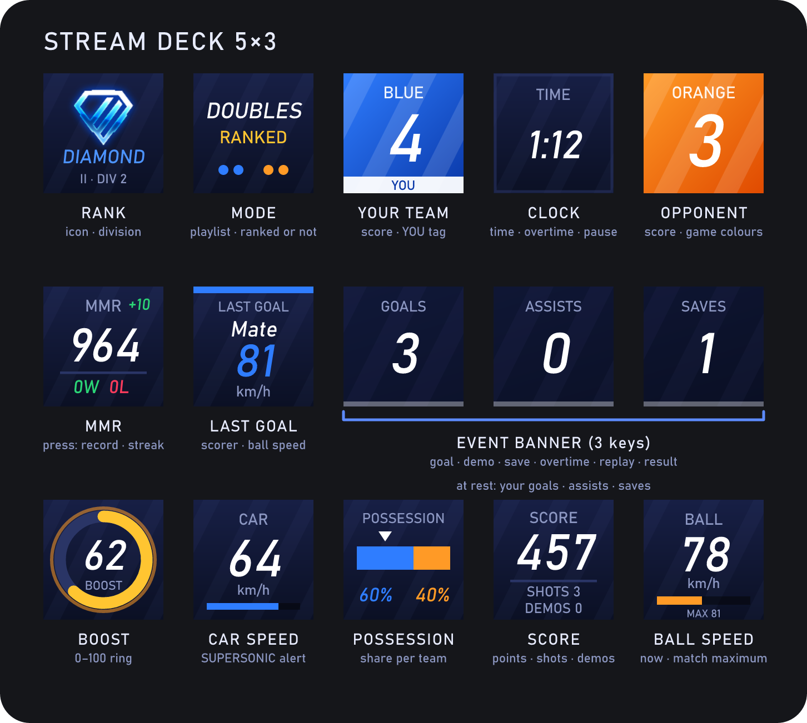
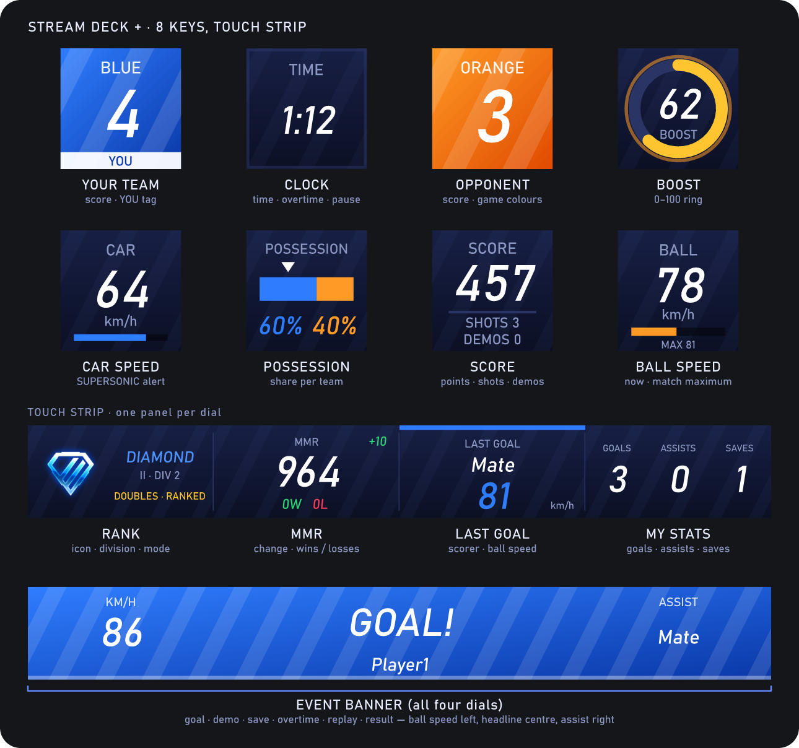
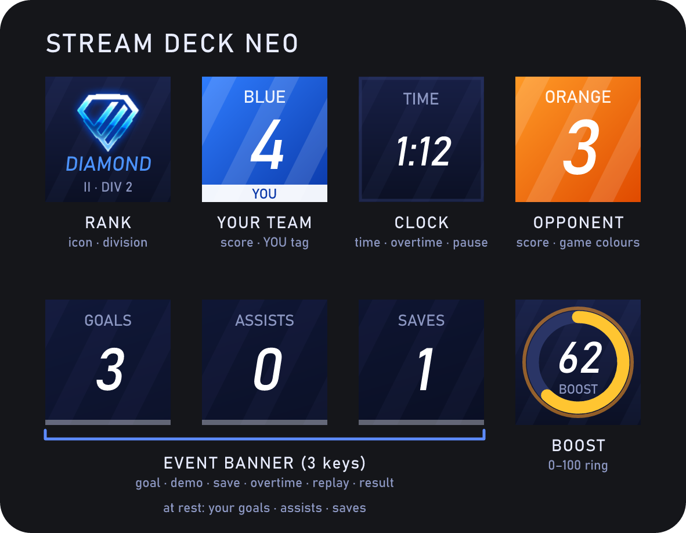
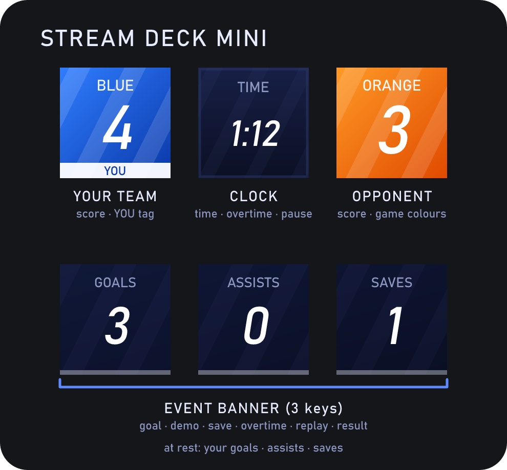
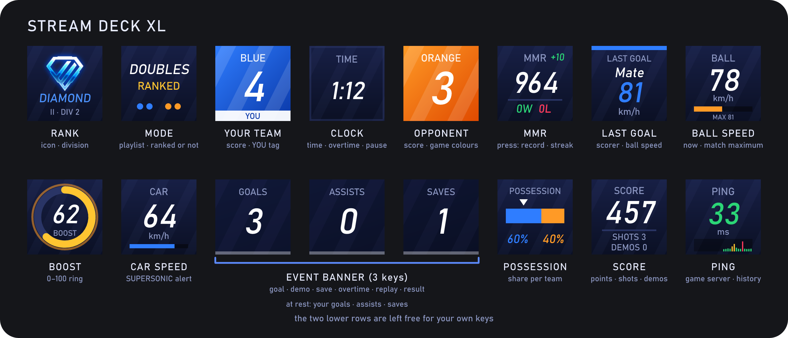
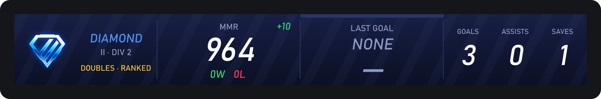
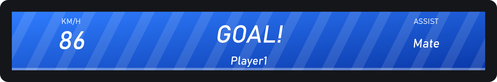

# Rocket League HUD for Stream Deck

🇬🇧 **English** · 🇵🇱 [Polski](README.pl.md)

A plugin for the 15-key Stream Deck (5×3) and the Stream Deck +. While Rocket League runs it shows the score, clock, rank, the last scorer with the
ball speed, demos, saves, and your own boost, car speed, possession and points on the keys.

**Install → start the game → it works.** The plugin turns on the game's official
[Stats API](https://www.rocketleague.com/developer/stats-api) by itself and shows the match on your keys. Switching the deck to its own
profile when the game starts is optional and **off by default** (see [Profile switching](#profile-switching)).

The plugin only reads data: it controls neither mouse nor keyboard and sends nothing to the game.

> Unofficial project — not affiliated with Psyonix, Epic Games or Elgato. "Rocket League" is a trademark of Psyonix.

## Preview on different decks

Every key drawn as it looks in a running match, with its function named underneath — one picture per supported deck.

<p align="center"></p>

<p align="center"></p>

<table>
  <tr>
    <td align="center"><br><sub>Stream Deck Neo</sub></td>
    <td align="center"><br><sub>Stream Deck Mini</sub></td>
  </tr>
  <tr>
    <td align="center" colspan="2"><br><sub>Stream Deck XL</sub></td>
  </tr>
</table>

<sub>Renders generated by `npm run preview:layout`. The numbers (MMR, rank, score, points, speeds) come from real matches; player names are placeholders.</sub>

## Install

1. Download `Rocket-League-HUD.streamDeckPlugin` from the [latest release](../../releases/latest) (direct link: [`Rocket-League-HUD.streamDeckPlugin`](../../releases/latest/download/Rocket-League-HUD.streamDeckPlugin)), double-click it and confirm the install in the Stream Deck app. (Building it yourself: `npm run pack`, see Development.)
2. Start Rocket League. If the game was already running when you installed the plugin, **restart it once** (the game reads its
   configuration only at startup; until then a key shows "RESTART GAME").
3. Click any key of the plugin in the Stream Deck app → inspector on the right: enter **your ranks** (see below).

Requirements: Stream Deck 6.6+ (tested with 7.0.3), Windows 10/11, Rocket League from Epic Games or Steam.

## Language

Keys and inspector are in **English** by default. Switch to Polish in the inspector (any key of the plugin → **General →
Language**). The change applies to all keys immediately.

## Key layout

```
 RANK         MODE           SCORE (you)   CLOCK        SCORE (opponent)
 MMR + W/L    LAST GOAL      ┌──────────  EVENT BANNER  ──────────┐
 BOOST        CAR            POSSESSION    SCORE        BALL (km/h)
```

| Key | What it shows |
|---|---|
| **Rank** | Emblem and name of your rank for the ranked mode you are playing (Duel / Doubles / Standard …). In modes **without a ranking** (casual, free play, private match) it says **UNRANKED** and names the mode — it never borrows the rank of a similar ranked mode. |
| **MMR + W/L** | Your MMR for that mode, and your win/loss record since the game started. **Press it** to swap them (the record becomes the big number, MMR small underneath), press again for your current **win streak** (it survives restarts), and again to go back — each with a swap animation. In a casual match this is the hidden casual MMR from the game log, labelled "CASUAL MMR". |
| **Mode** | The playlist, **RANKED** or **UNRANKED**, and the team size. |
| **Score (left / right)** | Each team's goals in **the colours the game shows them in** (e.g. a black or grey opponent). **Your team** is on the left (like the game's HUD), the opponent on the right; yours carries a "YOU" tag. Flashes on a goal. A setting can force "blue always on the left". The label is the team's own name (e.g. a club) or "BLUE / ORANGE" in the plugin's language. |
| **Clock** | Time left, overtime (`+0:12`), pause. Last 30 s in red. |
| **Last goal** | Who scored and how fast the ball was — stays after you leave the match. |
| **Banner** (3 keys) | **Goal** (speed · GOAL! + scorer · assist), **demo** (who → whom), save, epic save, crossbar, overtime, replay, countdown, victory/defeat. With no event: your goals / assists / saves in the match. |
| **Ball** | Current ball speed, a bar and the match maximum. |
| **Boost** | Your boost 0–100 as a ring; turns red and blinks when it runs low. |
| **Car** | Your car's speed and a bar up to the sound barrier; **SUPERSONIC** flashes once you break it. |
| **Possession** | Which team touched the ball last (marker) and each team's share of the match — in the same colours and order as the score. |
| **Score (points)** | Your points in the match, plus shots and demos. |
| **Clock** | The current time of this computer with the date; 24-hour or 12-hour (inspector). **Press it** to switch between hours over minutes and one smaller line (kept clear of the key edges). Works with or without the game, and as a touch-strip panel. |
| **Analog clock** | A round dial with hour ticks and thick, high-contrast hands: hour and minute in white, the second hand in red. |
| **Ping** | Live ping to the game server of your match, coloured green / gold / red, with a small history graph. See [Ping](#ping). |

Arrange the keys any way you like (category "Rocket League HUD"). Three *Banner* keys in one row join into one wide banner
(left to right); the order can be forced in the key's inspector.

## Supported decks

Installing the plugin creates a separate **"Rocket League HUD"** profile on every connected deck of a supported model (Stream Deck
6.6+ does this on install and does not switch to it). Use it from the Stream Deck's profile list, or let the plugin switch to it when the
game starts and back when it closes — see [Profile switching](#profile-switching).

| Deck | Keys | What you get |
|---|---|---|
| Stream Deck / MK.2, mobile app | 5×3 | the full layout below |
| Stream Deck Mini | 3×2 | score, clock and the event banner (at rest: your goals / assists / saves) |
| Stream Deck XL | 8×4 | the full layout, with the two lower rows left free for your own keys |
| Stream Deck Neo | 4×2 | rank, score, clock, the event banner and boost |
| Stream Deck + | 4×2 keys, 4 dials | 8 keys and the touch strip — see [Stream Deck +](#stream-deck--touch-strip) |
Other decks (Pedal, Studio, + XL, …) have no bundled profile yet — the plugin does not switch them, but every action can still be
dragged onto their keys by hand. The 5×3 profile is the one used on real hardware; the Mini, XL, Neo and + profiles are verified
against simulated devices only (structure, profile switching, key layout).

## Profile switching

By default the plugin **does not switch profiles**: you use the "Rocket League HUD" profile from the Stream Deck's own profile list,
or set your own profile for Rocket League in the profile options of the Stream Deck app (it can switch per application by itself).
To let the plugin do it — switch to its profile when the game starts and back when the game closes — tick **Switch profile
automatically when the game starts** in the plugin's inspector (General).

## Ping

Rocket League shows ping in-game but does not report it to other programs. The game does log the dedicated server it joins, and
the plugin measures the round trip to that address (an ordinary ICMP ping, about every two seconds) while a match runs. It is the
network latency to the game server — close to, but not exactly, the number in the game's scoreboard. If the server does not answer
ICMP the key shows "LOSS" instead of a number. Nothing is sent anywhere but that one server.

## Stream Deck + (touch strip)

The plugin also supports the **Stream Deck +** (8 keys, 4 dials and a touch strip). The animated banner that uses three keys on the
5×3 deck can run across the whole touch strip instead.


<p align="center"><br><sub>Between events: rank, MMR, last goal, your goals / assists / saves</sub></p>
<p align="center"><br><sub>A goal: ball speed on the left, GOAL! and the scorer in the middle, the assist on the right</sub></p>

* The bundled profile has your score, the clock, the opponent's score, boost, car speed, possession, points and ball speed on
  the 8 keys, and the **Touch strip** action on each of the four dials.
* **Between events** every dial's quarter of the strip shows one panel — rank icon and name, MMR with its change and your
  win/loss record, the last goal, and your goals / assists / saves. **When something happens** (goal, demo, save, overtime,
  replay, victory …) the four quarters together show the same animated banner as the three banner keys, across the full width.
* **Choose the panels:** in the inspector of each dial you can pin that quarter of the strip to *rank*, *MMR*, *last goal*, *my stats*, *clock* or *ping* (default: rank, MMR, last goal, my stats). Events still take the whole strip while they last.
* The strip is optional: take the actions off the dials and the keys work exactly as before. To arrange it yourself, drag
  **Touch strip (Stream Deck +)** onto the dials in the Stream Deck app. Each dial shows the quarter above it; the action's
  inspector lets you pin a different one.
* **Not tested on real hardware:** there was no Stream Deck + to try it on. It is verified against a simulated device (the
  strip images, the profile switch and the protocol messages), and the bundled profile has the same structure as Elgato's own
  Stream Deck + profile (the one that ships with the Volume Controller plugin), but it has not been tried on a real device. If
  it does not show up, add the actions by hand and please open an issue.

## MMR comes from the game log; the rank you enter

**MMR fills in by itself.** Rocket League writes your skill value to a local file, `Documents\My Games\Rocket League\TAGame\Logs\Launch.log`,
every time you start a queue (`PartyLeaderMMR`). The plugin reads that file (no login, no API, no interference with the game)
and converts it with `MMR = mu × 20 + 100`. The conversion was checked against a rocketleague.tracker.network profile:
47.4225 → 1048 (tracker: Casual 1,048); 28.5405 → 671, and the tracker showed 655 after a lost match (−16).

* The value is written **before the match**, so the new value shows up when you start the next queue for the same playlist.
  The key also shows the change since the previous queue (e.g. `+9`, `−16`).
* Only queues for **a single playlist** and **without a party** count (with several playlists the game logs an average, and in a
  party the "leader" may be someone else). In the menu the key shows the MMR of the playlist queued last; in a match, that of the
  playlist being played.
* `PartyLeaderTier` in the log is **not** the rank of a playlist (it is constant — your highest tier over all playlists), so you
  **enter rank and division by hand** in the inspector ("Your ranks"). The MMR typed there is only a fallback, and applies to
  ranked modes only.
* If an icon file is missing, the plugin draws its own emblem instead.

## Rank icons

The rank key uses the game's own rank icons (Bronze I … Supersonic Legend, and one for unranked play). They are © Psyonix / Epic Games,
taken from the [Rocket League Wiki](https://rocketleague.fandom.com), reduced to 96×96 px and used only to show your own rank in
this free, unofficial plugin. They are **not** covered by this repository's licence — see
[`imgs/ranks/NOTICE.txt`](mov.remake.rlhud.sdPlugin/imgs/ranks/NOTICE.txt). If the rights holder objects, they will be removed
and the plugin falls back to its own built-in emblems.

To use different icons, put PNG files into `%APPDATA%\RLHUD\rank-icons\` — they win over the bundled ones (the folder is created on
first start; the inspector shows its path and how many custom icons were found).

* File names: `bronze-1.png` … `diamond-2.png` … `grand-champion-3.png`, `supersonic-legend.png`, `unranked.png` — or the tier number, `0.png` … `22.png`.
* PNG, up to 200 KB, roughly square with a transparent background works best.
* New files are picked up within a few seconds, no restart needed.

## How it knows which player is you

The game writes into `Launch.log` which account it is logged in with (`HandleLocalPlayerLoginStatusChanged PlayerName=… PlayerID=Epic|…|0`).
`PlayerID` is exactly what the Stats API sends as `PrimaryId`, so your points, boost, speed, team and the "YOU" tag always come
from the right player — on every computer, with no setup. The camera is a last resort only, when there is no log. The inspector
shows "You in game: <name>" and warns when a name typed by hand differs from the account the game is logged in with.

From the log the plugin reads **only** that one line and the MMR lines. The same file also holds lines with a one-time Epic login
code — the plugin never reads, stores or logs them.

## Diagnostic match log

**Off by default.** If you turn it on in the inspector ("Keep a small anonymised match log"), the plugin writes a small, **anonymised** Stats API log locally (`%APPDATA%\RLHUD\captures\stats-api.ndjson`, about
2×3 MB at most): other players are replaced by P2, P3…, only your own name and id remain. Nothing is sent anywhere. It exists to
analyse bugs seen in real matches, e.g. to attach to a bug report; the plugin does not need it to work.

## Troubleshooting

The inspector shows at the top: whether the game is running, whether the Stats API is connected, the state of the game
configuration and the id of the last playlist.

| Symptom | Cause / fix |
|---|---|
| "RESTART GAME" on the banner | The game started before the plugin enabled the Stats API. Restart Rocket League. |
| Banner says "Start the game" although it is running | The installed game was not found — enter the folder under Advanced → "Game folder". |
| Wrong mode / "Playlist #NN" | Unknown playlist id — record a match (`npm run record`) and add the id to `src/core/playlists.ts`. |
| The 3-2-1 kickoff digits are not in step with the game | Advanced → **Countdown offset (ms)**: positive values show the numbers later, negative earlier. By default they fill the last 3 s before the round starts (the game takes a steady 4.0 s from the announcement to the start). |

Plugin log: `%APPDATA%\Elgato\StreamDeck\Plugins\mov.remake.rlhud.sdPlugin\logs`.

## What exactly it does to the game's files

At startup (and after the game closes) the plugin sets `PacketSendRate=10` in `…\TAGame\Config\DefaultStatsAPI.ini` (and
`TAStatsAPI.ini` if it exists), if it was `0`. Existing non-zero values are never overwritten, comments and line endings are
kept, and a `*.rlhud.bak` copy is made before the first change. The tests for this logic are in `test/core.test.ts`.

## The real Stats API versus its documentation

The plugin was corrected against recordings of the real game (`npm run record`). Differences from the official documentation:

* `Data` in every message is a **string containing JSON**, not an object.
* Speeds (ball, car, `GoalSpeed`) are **already in km/h** — the documentation says "uu/s".
* Polish team names arrive in Windows-1250 — the plugin repairs the encoding of every string separately.
* "Spectator-only" fields (`Speed`, `Boost` …) are also sent to the local player — including in online matches.
* `Teams[].ColorPrimary` is the team's real colour (default `1873FF` / `C26418`; a club can change it, e.g. to black `262626`).
* The score in `UpdateState` is reliable during replays; the plugin still ignores everything that arrives in a replay.
* **Not yet verified in a match with other players:** the `StatfeedEvent` names (demolition, save), the Hoops/Rumble/Dropshot playlist ids.

## License

[MIT](LICENSE) **with the Commons Clause** (this applies to the plugin's own code and artwork, not to the game's rank icons — see above): you may use, copy, modify and share the plugin freely, but you may not **sell** it
or a product or service whose value comes substantially from it (including paid hosting, support or consulting around it).
Because of that condition this is *source-available*, not "open source" in the OSI sense. Streaming with it on a monetised
channel is fine — you are not selling the plugin.

## Development

```bash
npm install
npm run build        # manifest + artwork + profile + bundle (esbuild)
npm test             # unit tests + tests on a real match recording (test/fixtures)
npm run e2e          # plugin ⇄ fake Stream Deck ⇄ fake game (hermetic — never touches a real game)
npm run preview      # draws the deck for match scenarios → preview/*.png
npm run mock         # fake game (ws://127.0.0.1:49124) — demo without Rocket League
npm run record       # records the real Stats API to captures/*.ndjson + a summary
npm run pack         # typecheck + tests + build + validation + dist/*.streamDeckPlugin
```

Structure: `src/core` (match state, no Stream Deck dependency; texts in `src/core/i18n.ts`), `src/ui` (SVG drawing),
`src/net` + `src/sys` (WebSocket, game configuration), `src/hub.ts` (glues it together), `tools/` (generators and tests).
A new language is one dictionary in `src/core/i18n.ts` and one in `mov.remake.rlhud.sdPlugin/ui/pi.html`.
